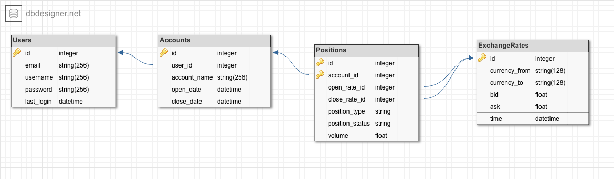

# Traders

## Descriptions
We will be implementing a platform for testing and analyzing algorithmic trading strategies. The few trading platforms that offer an API for buying and selling on demo accounts are not geared towards applications for machine learning analysis. On the other hand, 3rd party platforms exist that can be tuned for algorithmic trading analysis but are very complex and difficult to modify to fit the needs of a ML approach. What we will design is a platform that abstracts the storage of tick data and client data and allows clients to easily implement, test, and analyze ML algorithms on real data. Essentially, our platform will be a hybrid between the simplicity of corporate trading APIs which are simple but lack freedom and 3rd party APIs which are complicated and not geared towards an ML approach.  

Our data will come from GAIN capital, a repository of historical Forex (exchange rate) values. For simplicity, we will only concern ourselves with the major currencies. Each user will have the ability to create their own accounts, for example an account for each different trading algorithm. Their trading history will be stored online, so that if their algorithm crashes anywhere, their trades will be saved and they can pick up where they left off (another advantage of not using the 3rd party offline APIs). Using the trading history, we will have a webpage for each user account that displays the statistics and history of the account. While users will be able to request data in order to do offline and more complex analysis, it is convenient to have a webpage that will display the current progress and the history of the account value.  

Our functionality is divided into two main sections, the webpage and the user API. The basic functionality will be the storage of tick data and the ability for users to create accounts and open/close positions. The advanced functionality will be the analysis of the user accounts on the webpage as well as the API that allows users to request all necessary information in order to analyze tick data or train a ML algorithm.  

## Webpage Functionality
- Login page
    - Failed logins, create new user
- Account page
    - This page is reached upon successful login
    - If a user has no accounts, this webpage will be blank with a single button (Create new account) which allows users to enter in how much starting equity they would like
    - This page will have a dropdown menu of all user accounts in order to easily switch between them.
    - A table of a history of trades, a simple statistical analysis, and a graph of account value over time will all be shown.

## API Functionality
- Request account information
     - Users will be able to retrieve all information about an account (history, value, spendable equity etc)
- Request symbol prices
    - Users will be able to request price points of specified exchange rates of desired time intervals
- Send open/close signals
    - Users will be able to send open/close signals, and will receive a response from our API whether the trade was successful or not (and why not).
- Send open/close accounts
    - Users can open new accounts or create old ones.

## DB Schema 

